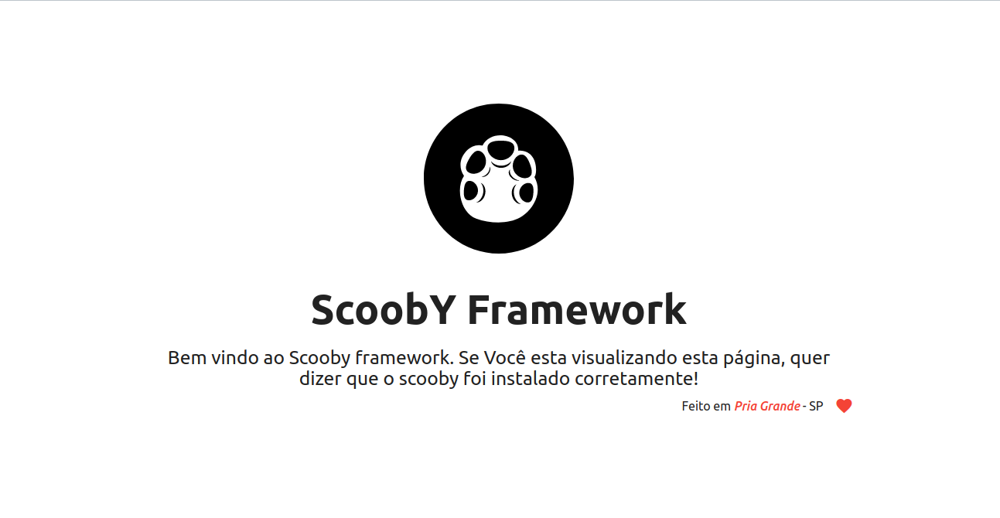
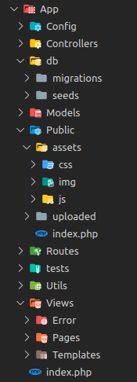

#  ScoobyPHP

> Um framework MVC feito com PHP e muito amor para tornar o desnvolvimento web muito mais simples e divertido.

O desenvolvimento de aplicações web tem se tornado cada vez mais necessário no cenário atual, seguindo esta tendência, a padronização de escrita de código, estruturação de projeto e etc tem evoluído cada dia mais, não é difícil nos depararmos com novos padrões adotados pela comunidade. Levando em consideração toda essa evolução e necessidade, proporcionamos aos desenvolvedores, principalmente aqueles que estão tendo um primeiro contato com um framework
php
, uma maior facilidade e conforto na estruturação dos diretórios, agilidade e desempenho nas entregas, segurança e organização do projeto.

## Instalação

### OS X & Linux

O modo mais fácil de instalar o ScoobyPHP é clonar o repositório do instalador no github, ou baixar o instalador no site oficial.
Lembrando que será necessário ter o composer e o npm instalado no computador em questão.

Clonando o instalador:

```sh
git clone https://github.com/terriani/ScoobyNewProject.git
```

Baixando o instalador pelo site oficial:

vá ate o site oficial que se encontra em ScoobyPHP.tech/install, baixe o instalador, descompacte no diretório onde será criado o projeto, htdocs/ ou www/ por exemplo e pronto isso será o bastante para iniciarmos com o ScoobyPHP.

Após clonar o repositório ScoobyNewProject acesse ele e copie o arquivo que encontra-se em seu interior, caso tenha efetuado o download no site o arquivo estará pronto para o uso, não sendo necessário entrar na pasta e copiar o mesmo.

para rodarmos o instalador do ScoobyPHP basta e entrar na pasta onde o arquivo scooby-create-app se encontra e executar o comando:

```sh
php scooby-create
```

Ao executar este comando, será solicitado no terminal que o programador de um nome para o novo projeto, informe este nome e aguarde o termino da instalação. Pode ser que o instalador necessite da senha do usuário logado para a manipulação do cache e para dar as devidas permissões no projeto, caso isso aconteça, informe a senha requerida e aguarde o fim da instalação.

Quando a instalação chegar ao final uma mensagem de informando o sucesso desta operação sera apresentada, note que também será criado um repositório com o nome que foi informado no começo da instalação. Este diretório contem tudo que será necessário para o desenvolvimento da sua nova aplicação web.

### Windows

Primeiramente será necessário fazer o download do git bash no site: git-scm.com

Após o download e instalação do git bash siga o guia de instalação para LINUX e OS X

### Clonando o ScoobyPHP direto do github

Também é possível clonar o repositório do ScoobyPHP direto do github, para isso basta entrar no terminal, ou caso esteja usando windows, será necessário utilizar o git bash e navegar ate a pasta onde ficam os projetos, por exemplo, htdocs/ ou www/, execute o comando:

```sh
git clone https://github.com/terriani/ScoobyPHP.git
```

Após clonar o projeto será necessário instalar as suas dependências, para isto basta rodar dois comandos no terminal na pasta raiz do projeto. Primeiro instale as dependências do composer, para isto execute:

```sh
composer install
```

Após o termino da instalação das dependências do composer, vamos instalar as dependências do javascript:

```sh
npm install
```

Pronto agora com as dependências instaladas, já é possível renomear a pasta do ScoobyPHP para o nome do seu projeto, Lembrando que será necessário entrar na pasta que do projeto, lá dentro entre em: App/Config/appConfig.php e altere o nome do seu projeto na constante APP_NAME, trocando o scoobyPHP para o nome que do projeto. Caso a instalação tenha sido feito com o instalador não será necessário fazer nenhuma alteração nas configurações do framework.

## Executando o projeto no navegador

Levando em consideração que todos os passos anteriores foram executados corretamente e seu servidor local, por exemplo o xampp, esteja rodando sem erro, abra seu navegador e digite na barra de endereço:

```sh
http://localhost/NomeDoProjeto/
```

Ou caso esteja utilizando um virtual host, digite no navegador o link setado nos arquivos de configuração da sua VHost.

Caso a instalação tenha dado tudo cero, uma tela de boas vindas será apresentada.



## Estrutura de pastas

A pasta *** App *** será onde toda a regra de negócio ficará, esta pasta contém os controllers, models, rotas, arquivos de configuração, seeds, migrations, a pasta public onde ficaram os arquivos css, javascript, imagens utilizadas na aplicação, imagens vindas de uploads, views e uma pasta nomeada de Utils, que será explicada sua função no decorrer deste guia.

**Atenção:** Por convenção o ScoobyPHP nomeia suas pastas com a primeira letra maiúscula, sendo assim, quando criar uma pasta ou uma sub-pasta,  por favor siga esta recomendação.

Estrutura de pasta App/:



### Breve descrição de cada pasta dentro do diretório App/

#### App/

Pasta onde será criada toda a regra de negócios da aplicação, em todo o ciclo de vida do web app só será necessário ter conhecimento desta pasta em questão.

#### App/Config

Esta pasta conterá todos os arquivos de configurações da aplicação, como por exemplo, configurações de banco de dados, envio de e-mail e etc...

#### App/Config/lang

Nesta pasta ficam os arquivos de tradução do systema, caso deseje fazer um sistema multilinguagem será abordado mais a diante deste guia como implementar esta funcionalidade.

#### App/Controllers

Aqui ficam todos os controlers da aplicação, esta pasta não aceita outras pastas dentro dela, ou seja, o ScoobyPHP até a versão atual não aceita pastas especificas para a criação de controllers específicos, por exemplo: App/Controllers/Auth/UserController, essa arquitetura de organização dos controllers separados em pastas irá gerar um erro na aplicação.

#### App/Db

Nesta pasta ficam os arquivos de migrations e seeds

#### App/Db/Migration

Dentro desta pasta ficaram todas as migrations geradas pelo sistema.

#### App/Db/Seeds

Dentro desta pasta ficaram todas as seeds geradas pelo sistema, ao decorrer deste guia sera abordado como gerar migrations, seeds e muito mais utilizando o scooby-do, uma ferramenta de linha de comando.

#### App/Utils

Nesta pasta pode ser usada para um propósito geral, para a criação de metodos auxiliares, extensão dos helpers, validações, etc...

#### App/Models

Aqui ficaram todo os models da aplicação, ao decorrer deste guia sera abordado como gerar models via terminal utilizando o scooby-do.

#### App/Public

Nesta pasta ficaram os arquivos públicos da aplicação.

#### App/Public/assats/css

Neste local ficará todos os arquivos css da aplicação, não deverá ser criadas pastas aqui dentro, pois o ScoobyPHP mapeia esta pasta para minificar os arquivos e inclui-los no template.

#### App/Public/assets/img

Aqui ficaram as imagem utilizadas pela aplicação

#### App/Public/assats/js

Neste local ficará todos os arquivos javascript da aplicação, não deverá ser criadas pastas aqui dentro, pois o ScoobyPHP mapeia esta pasta para minificar os arquivos e incluí-los no template.

#### App/Public/uploaded

Nesta pasta ficará todos os arquivos upados da aplicação

#### App/Routes

Nesta pasta ficaram todos os arquivos de rotas, caso necessário poderá ser criado mais de um arquivo contendo diferentes rotas do sistema.

#### App/tests

Aqui ficará todos os testes da aplicação [Ainda não está em funcionamento]

#### App/Views

Aqui ficam as paginas da aplicação, templates e paginas de erro

#### App/Views/Error

Nesta pasta ficam as páginas de erro do sistema, como por exemplo a página de erro 404.

#### App/Views/pages

Aqui ficam todas as páginas da aplicação, sendo assim o diretório responsável pelo frontend do app.

## Os componentes do MVC

Tradicionalmente usado para interfaces gráficas de usuário (GUIs), esta arquitetura tornou-se popular para projetar aplicações web e até mesmo para aplicações móveis, para desktop e para outros clientes. Linguagens de programação populares como Java, C#, Ruby, PHP e outras possuem frameworks MVC populares que são atualmente usados no desenvolvimentos de aplicações web.

### Camada de modelo ou da lógica da aplicação (Model)

Modelo é a ponte entre as camadas Visão (View) e Controle (Controller), consiste na parte lógica da aplicação, que gerencia o comportamento dos dados através de regras de negócios, lógica e funções. Esta fica apenas esperando a chamada das funções, que permite o acesso para os dados serem coletados, gravados e, exibidos.

É o coração da execução, responsável por tudo que a aplicação vai fazer a partir dos comandos da camada de controle em um ou mais elementos de dados, respondendo a perguntas sobre o sua condição e a instruções para mudá-las. O modelo sabe o que o aplicativo quer fazer e é a principal estrutura computacional da arquitetura, pois é ele quem modela o problema que está se tentando resolver. Modela os dados e o comportamento por trás do processo de negócios. Se preocupa apenas com o armazenamento, manipulação e geração de dados. É um encapsulamento de dados e de comportamento independente da apresentação.

### Camada de apresentação ou visualização (View)

Visão pode ser qualquer saída de representação dos dados, como uma tabela ou um diagrama. É onde os dados solicitados do Modelo (Model) são exibidos. É possível ter várias visões do mesmo dado, como um gráfico de barras para gerenciamento e uma visão tabular para contadores. A Visão também provoca interações com o usuário, que interage com o Controle (Controller). O exemplo básico disso é um botão gerado por uma Visão, no qual um usuário clica e aciona uma ação no Controle.

Não se dedica em saber como o conhecimento foi retirado ou de onde ela foi obtida, apenas mostra a referência. Segundo Gamma et al (2006), ”A abordagem MVC separa a View e Model por meio de um protocolo inserção/notificação (subscribe/notify). Uma View deve garantir que sua expressão reflita o estado do Model. Sempre que os dados do Model mudam, o Model altera as Views que dependem dele. Em resposta, cada View tem a oportunidade de modificar-se”. Adiciona os elementos de exibição ao usuário : HTML, ASP, XML, Applets. É a camada de interface com o usuário. É utilizada para receber a entrada de dados e apresentar visualmente o resultado.

### Camada de controle ou controlador (Controller)

Controle é o componente final da tríade, faz a mediação da entrada e saída, comandando a visão e o modelo para serem alterados de forma apropriada conforme o usuário solicitou através do mouse e teclado. O foco do Controle é a ação do usuário, onde são manipulados os dados que o usuário insere ou atualiza, chamando em seguida o Modelo.

O Controle (Controller) envia essas ações para o Modelo (Model) e para a janela de visualização (View) onde serão realizadas as operações necessárias.

# Configurações

## Desvendando as configurações do ScoobyPHP

Raramente o programador precisará alterar os arquivos de configuração do Scooby, porém, é de suma importância termos conhecimentos sobre seus arquivos.

### Conhecendo a pasta App/Config

Possuímos alguns arquivos de configuração dentro da pasta App/Config, são estes:

#### App/Config/Lang/

Nesta pasta ficam os arquivos de idioma do ScoobyPHP, para criar novos arquivos de tradução dentro do Scooby é bem simples, basta criar um novo arquivo dentro desta pasta, o nome deste arquivo deve seguir a tabela contida nesta página <a href='https://www.w3schools.com/tags/ref_language_codes.asp' target='_blank'>www.w3schools.com/tags/ref_language_codes.asp</a>, Após nomear o arquivo com referência ao idioma que sera incluso basta copiar o conteúdo de um dos arquivos já existentes, o conteúdo dos arquivos de tradução é um array $GLOBAL['key' => 'value'], onde a tradução devera ser feita substituindo o valor do value dentro do array.

```php

//Simulação de criação de novo arquivo de tradução

//Arquivo existente en.php
$GLOBALS = [
'WELLCOME_MSG' => 'Welcome to the Scooby framework. If you are viewing this page,
     it means that scooby was installed correctly! '
];

//Primeiro Criamos o arquivo pt-br.php e adicionamos o conteúdo do en.php, após isso traduzimos as mensagens e caso precise criamos novas mensagens
//Tradução, note que a chave do array permanece a mesma só alteramos o valor

$GLOBALS = [
'WELLCOME_MSG' => 'Bem vindo ao Scooby framework. Se Você esta visualizando esta página,
     quer dizer que o scooby foi instalado corretamente!'
]

```

Para acessarmos essas mensagens traduzidas em qualquer parte do sistema é muito fácil, basta chamarmos $GLOBALS[''], passando a chave que desejamos recuperar o valor.

```php
// Recuperando o valor de um arquivo de tradução
//chame-se a global passando a chave desejada
echo $GLOBALS['WELLCOME_MSG'];
```

Esse código ira imprimir na tela a mensagem de boas-vindas.

Para configurar um novo idioma basta abrir o arquivo situado em App/Config/appConfig.php e alterar a constante SITE_LANG para o idioma desejado.

```php
// Alteração de idioma de inglês para português

//Site lang definido em inglês
 define('SITE_LANG', 'en');

// Alterar para o idioma desejado, lembrando que o arquivo de tradução devera ter sido criado previamente
 define('SITE_LANG', 'pt_br'); 
```

#### App/Config/apiConfig.php

Este arquivo é muito importante, pois contém as configurações básicas para o desenvolvimento de APIs utilizando o scooby

Neste arquivo encontramos:

```php

// Definir se a aplicação será uma API ou um projeto WEB monolítico
define('IS_API', false);

// Hash para encriptação do jwt único, gerado ao criar o projeto
define('SECRET_KEY', '76783e11c38704ce746fa4f01cf4c85cb5db840077d4d4e4a4bf250824f155bb');

// Constante para definição de origens permitidas 
define('ORIGIN_ALLOW', '*');

// Constante para definição de metodos permitodos 
define('METHODS_ALLOW', 'GET, POST, PUT, DELETE');

// 
define('CREDENTIALS_ALLOW', true);

```

#### App/Config/appConfig.php

No arquivo appConfig encontramos as configurações básicas da aplicação como APP_NAME, BASE_URL e etc...

```php
//define o nome do site em desenvolvimento
    define('APP_NAME', 'ScoobyPHP');

    //Url base para caso o controller não seja indicado na url
    define("HOME", "home");

    //define o idioma das menssagens exibidas automaticamente pelo o framework em desenvolvimento
    define('SITE_LANG', 'pt-br');

    //define a url base do sistema
    define("BASE_URL", "/");

    // Nome dado a rota de erro http
    define('ROUTE_ERROR', 'ooops');
```

#### App/Config/assetsConfig

Neste arquivo encontramos todas as configurações de assets da aplicação.
Em **ASSETS_VERSION** temos um valor definido como 1, este valor é a versão atual dos seus assets, ao um projeto em produção, alteramos o conteúdo do arquivo  ***env.php*** para "***production***" e subimos o projeto para o servidor, com o projeto em ambiengte de produção ao alterarmos o conteúdo de algum de nossos arquivos de assets como os ***CSS*** ou o ***JS*** da nossa aplicação devemos mudar a verssão da constante **ASSETS_VESRION** para 2 e assim por diante, agora caso queira voltar uma versão especifica dos assets do projeto basta alterar o assets versio para o número desejado.

#### App/Config/assetsInclude.php

A utilização deste arquivo é bem simples e intuitivo, dentro do array ***html*** temos 3 arrays, o ***header***, ***bodyTop*** e ***bodyBottom***, a função destes arrays são receber as tags ***Link*** e ***Script***, por exemplo, vamos supor que precisamos adicionar uma tag link no ***header*** do template da nossa aplicação, arquivo assetsInclude.php ficaria assim

```php

$html = [
    'header' => [
        // Este arquivo sera carregado no header da aplicação
        "<link rel='stylesheet' href='" . ASSET . "css/404.css'>"
    ],
    'bodyTop' => [
        // Aqui ficara os arquivos carregados na parte superior da body
    ],
    'bodyBottom' => [
        // Aqui ficara os arquivos carregados na parte superior da body
    ]
];

```

#### App/Config/authConfig.php

Por padrão o ScoonyPHP não autentica somente suas rotas e controllers, ele também autentica suas views, oferecendo assim mais uma camada de segurança para suas aplicações.
Ao criarmos uma view, precisamos registar ela no arquivo ***authConfig.php***, este arquivo possui dois arrays, um chamado ***notAutentication*** e o outro nomeado como ***autentication***, para as views públicas, que serão vistas por todos e não somente por usuário logados no sistema, devera ser adicionado o nome ao array notAutentication, e as views que só poderão ser visualizadas por usuários logados deverão ser registradas no array autentication. Para registrar uma view e muito simples, basta adicionar o nome da mesma, sem a extensão ***.twig***.

```php

/**
 * Array contendo as views que não passarão pela autenticação
 */
$notAutentication = [
    // Aqui ficam as view não autenticadas 
    '404',
    'home',
];

/**
 * Array contendo as views que passarão pela autenticação
 */
$autentication = [
    // Aqui ficam as views autenticadas
];

```

#### App/Config/databaseConfig.php

Neste arquivo podemos efetuar todas as configurações de banco de dados, tanto em modo de desenvolvimento como em produção

#### App/Config/emailConfig.php

Neste arquivo podemos efetuar todas as configurações de um servidor ***SMTP***, tanto em modo de desenvolvimento como em produção

#### App/Config/env.php

Neste arquivo definimos se nossa aplicação está em modo desenvolvimento ou em produção

#### App/Config/SEOConfig.php

Neste arquivo podemos efetuar todas as configurações de ***SEO*** da aplicação, tanto em modo de desenvolvimento como em produção

#### App/Config/twigGlobalVariables.php

Neste arquivo podemos definir variáveis globais para usarmos em nosso frontend com ***.twig***, segue um exemplo de definição de variável global em twig e sua recuperação no frontend da aplicação.

```php
$twig->addGlobal('nome_dado_a_variavel', 'Conteudo_da_variavel'),
```

e para usarmos essa variável em nossos arquivos ***.twig*** usamos:

```twig
{{ nome_dado_a_variavel }}
```
# Controllers

## Desvendadndo os Controllers

Ao se trabalhar com o padrão MVC grande parte do projeto será desenvolvido nos controllers, neste tópico iremos criar nosso primeiro controller, descobrir como chamar uma view, como instanciar um model, como utilizar alguns dos helpers do ScoobyPHP e muito mais...

### Criando um controller

para criarmos um controller, basta irmos ate a pasta Controllers, que se encontra em App/Controllers/, lá criaremos um novo arquivo com o nome desejado, com a primeira letra maiúscula e acompanhado da palavra Controller e finalizando com .php, ficando deste jeito por exemplo: HomeController.php.

Ao abrir o Controller recém criado basta adicionar o código abaixo:

```php

namespace Scooby\Controllers;

use Scooby\Core\Controller;

class HomeController extends Controller
{
    /**
    * @return void
    */
    public function index(): void
    {
        //
    }
}
```

Pronto, com algumas linhas de código já temos um controller criado e pronto para o uso. Uma rotina muito comum de se fazer nos controllers é o ato de chamar uma view, seja ela um formulário, uma tela de login ou qualquer outra tela existente na aplicação e para exibirmos uma view no navegador do usuário é muito simples, por estarmos estendendo o controller base do Scooby, temos acesso aos seus métodos e um deles é o metodo view, que é responsável por exibir uma view para o usuário final do app.

Para chamar uma view no navegador do usuário, levando em consideração que a view já foi previamente criada na pasta App/Views/Pages/, basta escrever o seguinte código dentro do método desejado. Exemplo de um controller chamando uma view na action index.

```php

namespace Scooby\Controllers;

use Scooby\Core\Controller;

class HomeController extends Controller
{
    /**
    * Metodo index está chamando uma view na pasta Pages com o nome Home.twig
    *
    * @return void
    */
    public function index(): void
    {
        $this->view('Pages', 'Home', []);
    }
}
```

Note que o método view mapeia a chamada para dentro da pasta App/Views, sendo necessário somente informar a pasta em que você deseja chamar o arquivo de visualização. Note também que o método view recebe como terceiro parâmetro um array, que no caso do exemplo está vazio, porém neste array mandamos informações para a view, podendo ser strings, retornos de métodos, ou qualquer coisa que desejarmos.

Exemplo de envio de um texto de boa vindas do metodo index para a view home.

```php

namespace Scooby\Controllers;

use Scooby\Core\Controller;

class HomeController extends Controller
{
    /**
    * Envio de msg de boas vindas para a view home.twig que se encontra em: App/Views/pages/
    *
    * @return void
    */
    public function index(): void
    {
        $this->view('Pages', 'Home', [
            'wellcomeMessage' => 'Sejam Bem Vindos ao SccobyPHP!!!'
        ]);
    }
}
```

Para passarmos o valor para a view usamos um array associativo, onde a chave do array, que no nosso exemplo é ' wellcomeMessage ', será a variável que acessaremos na view, neste momento não precisa se preocupar e caso não tenha entendido como será feita esta tarefa, quando entrarmos no estudo de views todas as dúvidas serão sanadas.

Podemos também setar um titulo para a view a ser apresentada, para isto basta usarmos o metodo

```php
$this->setTitle('Titulo da página');
```

Neste caso o controller ficaria assim:

```php

namespace Scooby\Controllers;

use Scooby\Core\Controller;

class HomeController extends Controller
{
    /**
    * Adiciona o titulo Hello World para a view wellcome
    *
    * @return void
    */
    public function index(): void
    {
        $this->setTitle('Hello world');
        $this->view('Pages', 'Home', [
            'wellcomeMessage' => 'Sejam Bem Vindos ao SccobyPHP!!!'
        ]);
    }
}
```

Caso nenhum titulo seja informado no controller, o APP_NAME será o titulo de todas as páginas do projeto, neste caso como o APP_NAME esta definodo para ScoobyPHP, todas as páginas herdarão este titulo.

Caso precisemos recuperar parametros enviados pelas **rotas** da nossa aplicação, basta adicionar uma variável na chamada da **action** e passar essa variável no formato de um array com a chave contendo o nome dado ao elemento a ser recuperado.
Vamos supor que uma rota envia um nome e desejamos recuperar este nome no HomeController


O arquivo de rota ficaria assim:
```php
$route->get('/{name}', 'HomeController@index');
```

Eo controller ficaria:

```php

namespace Scooby\Controllers;

use Scooby\Core\Controller;

class HomeController extends Controller
{
    /**
    * Adiciona o titulo Hello World para a view wellcome
    *
    * @return void
    */
    public function index($param): void
    {

        $name = $param['name'];

        $this->setTitle('Hello world');
        $this->view('Pages', 'Home', [
            'nome' => $name
        ]);
    }
}
```
 
Muitas vezes em que estamos escrevendo uma aplicação, principalmente quando estamos criando uma **API**, precisamos retornar não uma **view**, mas sim um **Json**, para retornar um jason no ScoobyPHP basta chamar $this->Json() e passar um array com os dados a ser retornado

```php

namespace Scooby\Controllers;

use Scooby\Core\Controller;

class HomeController extends Controller
{
    /**
    * Retorna um json
    *
    * @return void
    */
    public function index(): void
    {
        $this->Json(['data' => 'Dado a ser retornado']);
    }
}
```

Outra coisa muito comum é trabalharmos com dados vindos do banco de dados, por usarmos o Eloquente como ORM no ScoobyPHP, temos uma facilidade muito grande ao lidarmos com os Models.

Veja agora um exemplo de consulta em uma tabela de usuarios.
OBS: Na sessão de Models será melhor explicado como se tarbalhar corretamente com o Eloquent e com o models dentro do ScoobyPHP.

```php

namespace Scooby\Controllers;

use Scooby\Core\Controller;
use Scooby\Models\User;

class HomeController extends Controller
{
    /**
    * Retorna um json
    *
    * @return void
    */
    public function index(): void
    {
        $user = new User;
        $u = $user->find(1);
        $this->Json(['user' => $u->name']);
    }
}
```

Veja como é simples trabalhar com controllers no ScoobyPHP. Mais para a frente aprenderemos a usar o ***scooby-do***, o CLI integrado no Scooby.

# Models 

## desvendando os models do eloquent

> Pelo fato de usarmos o eloquent rom no ScoobyPHP então esta documentação é uma adaptação da documentação original do eloquent, que pode ser encontrada em: <a href='https://laravel-docs-pt-br.readthedocs.io/en/latest/eloquent/'>https://laravel-docs-pt-br.readthedocs.io/en/latest/eloquent/</a>

O Eloquent ORM incluso muito famoso por ser o ORM criado e utilizado no **Laravel** fornece uma bonita e simples implementação ActiveRecord para trabalhar com seu banco de dados. Cada tabela do banco de dados tem um "Model" correspondente que será usado para interagir com a tabela, por isso adotamos este ORM para trabalahrmos no ScoobyPHP.

Antes de iniciarmos, certifique se de configurar uma conexão com o banco de dados no App/Config/databaseConfig.php.


### Uso Básico
Para começar, crie um model. Models ficam armazenados no diretório **App/Models**

Definindo um Model no ScoobyPHP

```php
namespace Scooby\Models;

use Scooby\Core\Model;

class User extends Model 
{

}
```

Note que não informamos ao Eloquent que tabela o modelo User irá usar. O nome da classe em letra minúscula e no plural, será usado como o nome da tabela, a menos que outro nome seja especificado. Sendo assim, o Eloquent assume que modelo User armazena os registros na tabela users. Especifique a propriedade table no seu modelo, caso queira usar um nome personalizado para a tabela:

```php
namespace Scooby\Models;

use Scooby\Core\Model;

class User extends Model 
{
	protected $table = 'my_users';
}
```

Nota: Eloquent irá assumir também, que cada tabela possui uma chave primária com o nome id. Caso queira usar outro nome, defina a propriedade primaryKey.

Uma vez que o modelo está definido, você está pronto para começar a recuperar e criar registros na sua tabela. Note que você vai precisar colocar as colunas updated_at e created_at em sua tabela por padrão. Se você não deseja ter essas colunas mantidas automaticamente, defina a propriedade $timestamps no seu modelo para false

Recuperando Todos Os Modelos(Registros)

```php
$users = User::all();
```

Recuperando Um Registro Através Da Chave Primária

```php
$user = User::find(1);
var_dump($user->name);
```

Nota: Todos os métodos disponíveis no construtor de consultas também estão disponíveis ao consultar modelos do Eloquent.

Consultando Usando Model Eloquent

```php
$users = User::where('votes', '>', 100)->take(10)->get();

foreach ($users as $user)
{
    var_dump($user->name);
}
```

Claro, você pode também usar funções agregadoras do construtor de consultas.

Agregadores No Eloquent

```php
$count = User::where('votes', '>', 100)->count();
```

Insert, Update, Delete
Para criar um novo registro em seu banco de dados por um modelo, simplesmente crie uma nova instância do modelo e chame o método save.

Salvando Um Novo Modelo

```php
$user = new User;

$user->name = 'John';

$user->save();
```

Você pode também usar o método create para salvar um novo modelo em uma só linha. A instância do modelo inserido será retornada do método:

Usando O Método Create Do Modelo

```php
$user = User::create(array('name' => 'John'));
```

Para atualizar um modelo, você o recupera, muda o atributo, e usa o método save:

Atualizando Um Modelo Recuperado

```php
$user = User::find(1);

$user->email = 'john@foo.com';

$user->save();
```

Você pode executar atualizações encadeando de consultas dos modelos:

```php
$affectedRows = User::where('votes', '>', 100)->update(array('status' => 2));
```

Para apagar um modelo, simplesmente chame o método delete method em uma instância:

Apagando Um Modelo Existente

```php
$user = User::find(1);

$user->delete();
```

Sim, você pode apagar encadeando uma consulta no modelo:

```php
$affectedRows = User::where('votes', '>', 100)->delete();
```

### Timestamps
Por padrão, Eloquent mantém as colunas created_at e updated_at nas tabelas do seu banco de dados, automaticamente. Basta adicionar essas colunas datetime para a sua tabela e o Eloquent vai cuidar do resto. Se você não deseja que o Eloquent mantenha essas colunas, defina a propriedade:

Disabilitando Auto Timestamps

```php
namespace Scooby\Models;

use Scooby\Core\Model;

class User extends Model 
{
    protected $table = 'users';
    
	public $timestamps = false;
}
```

Se desejar personalizar o formato de seus timestamps, sobrescreva o método freshTimestamp em seu modelo:

Fornecendo Um Formato Personalizado Para Timestamp

```php
namespace Scooby\Models;

use Scooby\Core\Model;

class User extends Model 
{
	public function freshTimestamp()
	{
		return time();
	}
}
```

### Relacionamentos
Suas tabelas do banco de dados provavelmente estão relacionadas a alguma outra. Por exemplo, um publicação de blog podem ter muitos comentários, ou pode estar relacionado ao usuário que publicou. Eloquent faz o gerenciamento e trabalho com essas relações

Um Para Um
Um Para Muitos
Muitos Para Muitos
Relacionamentos Polimórficos

Um para Um
Um relacionamento um-para-um é uma relação muita básica. Exemplo, um modelo User pode ter um Phone. Podemos definir essa relação no Eloquent:

Definindo Uma Relação Um Para Um

```php
namespace Scooby\Models;

use Scooby\Core\Model;

class User extends Model 
{
	public function phone()
	{
		return $this->hasOne('Phone');
	}
}
```

O primeiro argumento passado para o método hasOne é o nome do modelo relacionado. Assim que relação é definida, podemos recuperar isso usando propriedades dinâmicas do Eloquent:

```php
$phone = User::find(1)->phone;
```

O Sql realizado por essa instrução será como a seguinte:

```sql
select * from users where id = 1

select * from phones where user_id = 1
```

Note que Eloquent assume que a chave estrangeira do relacionamento é baseada no nome do modelo. No exemplo, o modelo Phone assume que a chave estrangeira usada é user_id. Se desejar sobrescrever essa convenção, passe um segundo argumento para o método hasOne:

```php
return $this->hasOne('Phone', 'chave_personalizada');
```
Para definir o inverso, a relação no modelo Phone, usamos o método belongsTo:

Definindo O Inverso De Uma Relação
```php
namespace Scooby\Models;

use Scooby\Core\Model;

class Phone extends Model 
{
	public function user()
	{
		return $this->belongsTo('User');
	}
}
```

Um para Muitos
Um exemplo de relacionamento um-para-muitos é um publicação de blog que "tem muitos" comentários. Podemos modelar essa relação:

```php
namespace Scooby\Models;

use Scooby\Core\Model;

class Post extends Model 
{
	public function comments()
	{
		return $this->hasMany('Comment');
	}
}
```

Agora podemos acessar os comentários da publicação através da propriedade dinâmica:

```php
$comments = Post::find(1)->comments;
```
Se você precisar adicionar mais restrições para as quais os posts são recuperados, poderá invocar o método comments e continuar com as condições de encadeamento:

```php
$comments = Post::find(1)->comments()->where('title', '=', 'foo')->first();
```

Novamente, você pode sobrescrever a convencional chave estrangeira passando um segundo argumento ao método hasMany:

```php
return $this->hasMany('Comment', 'custom_key');
```

Para definir o inverso dessa relação no modelo Comment, nos usámos o método belongsTo:

Definindo O Inverso De Uma Relação

```php
namespace Scooby\Models;

use Scooby\Core\Model;

class Comment extends Model 
{
	public function post()
	{
		return $this->belongsTo('Post');
	}
}
```

Muitos Para Muitos
Relações muitos-para-muitos é o tipo de relacionamento mais complicado. Um exemplo de um relacionamento é um usuário com muitos papéis(roles), onde os papéis também compartilhados por outros usuários. Exemplo, muitos usuários tem o papel de "Admin". Três tabelas são necessárias para este relacionamento: users, roles, e role_user. A tabela role_user é derivada da ordem alfabética dos nomes dos modelos relacionados, e devem ter as colunas user_id e role_id.

Podemos definir relações muitos-para-muitos usando o método belongsToMany:

```php
namespace Scooby\Models;

use Scooby\Core\Model;

class User extends Model 
{
	public function roles()
	{
		return $this->belongsToMany('Role');
	}
}
```

Agora podemos recuperar os papéis(roles) através do modelo User:

```php
$roles = User::find(1)->roles;
```

Se você quiser usar um nome de tabela não convencional para a sua tabela intermediária, você pode passar como um segundo argumento para o método belongsToMany:

```php
return $this->belongsToMany('Role', 'user_roles');
```

Você pode sobrescrever a convenção de chaves associadas:

```php
return $this->belongsToMany('Role', 'user_roles', 'user_id', 'foo_id');
```

Relacionamentos Polimórficos
Relacionamentos Polimórficos permitem um modelo pertencer a mais de um modelo numa simples associação. Exemplo, você pode ter um modelo photo(foto) que pertence a um modelo staff(equipe) ou a um modelo order(pedido). Definiríamos essa relação assim:

```php
namespace Scooby\Models;

use Scooby\Core\Model;

class Photo extends Model 
{
	public function imageable()
	{
		return $this->morphTo();
	}
}

class Staff extends Model 
{
	public function photos()
	{
		return $this->morphMany('Photo', 'imageable');
	}
}

class Order extends Model 
{
	public function photos()
	{
		return $this->morphMany('Photo', 'imageable');
	}
}
```

Agora, podemos recuperar as photos(fotos) de um membro da staff(equipe) ou de um order(pedido):

Recuperando Um Relacionamento Polimórfico

```php
$staff = Staff::find(1);

foreach ($staff->photos as $photo)
{
	//
}
```
Mas, a verdadeira magia do "polimórfico" é quando você acessa staff(equipe) ou order(pedido) do modelo Photo:

Recuperando O Dono De Um Relacionamento Polimórfico

```php
Photo::find(1);

$imageable = $photo->imageable;
```

A relação imageable no modelo Photo retornará uma instância de Staff ou Order, dependendo de qual tipo é o dono do modelo photo.

Para ajudar a entender como isso funciona, vamos explorar a estrutura do banco de dados dessa relação polimórfica:

#### Estruturas da Tabela da Relação Polimórfica

**staff**
	id - integer
	name - string

**orders**
	id - integer
	price - integer

**photos**
	id - integer
	path - string
	imageable_id - integer
	imageable_type - string
Os campos chave para observar aqui são imageable_id e imageable_type na tabela photos. O imageable_id conterá o valor do ID, que neste exemplo, será o staff ou order, enquanto que imageable_type irá conter o nome da classe dona do modelo. Isso é o que permite o ORM determinar que tipo possui o modelo para retornar quando acessar a relação imageable.


Carregamento Prévio
Carregamento prévio existe para aliviar problema com consulta N + 1. Exemplo, considere um modelo Book que está relacionado a Author. A relação é definida assim:

```php
namespace Scooby\Models;

use Scooby\Core\Model;

class Book extends Model 
{
	public function author()
	{
		return $this->belongsTo('Author');
	}
}
```

Agora considere o seguinte código:

```php
foreach (Book::all() as $book)
{
	echo $book->author->name;
}
```
Esse loop executará 1 consulta para recuperar todos os livros, em seguida, uma outra consulta onde cada livro recupera o autor. Então, se temos 25 livros, este loop executará 26 consultas.

Felizmente, podemos usar o carregamento prévio para reduzir drasticamente o número de consultas. As relações que devem ser carregadas previamente pode ser especificado através do método with:

```php
foreach (Book::with('author')->get() as $book)
{
	echo $book->author->name;
}
```

No loop acima, apenas duas consultas serão executadas:

```sql
select * from books

select * from authors where id in (1, 2, 3, 4, 5, ...)
```

Uso inteligente de carregamento prévio pode aumentar drasticamente o desempenho de sua aplicação.

Claro, você pode carregar previamente múltiplas relações de uma só vez:
```php
$books = Book::with('author', 'publisher')->get();
```

Você pode até mesmo carregar relações aninhadas:

```php
$books = Book::with('author.contacts')->get();
```

No exemplo acima, a relação author será previamente carregada, e a relação contacts também será carregada.

Condições de Carregamento Prévio
Talvez, você deseje carregar previamente uma relação, mas também especificar uma condição. Aqui está um exemplo:

```php
$users = User::with(array('posts' => function($query)
{
	$query->where('title', 'like', '%first%');
}))->get();
```

Nesse exemplo, posts dos usuários serão previamente carregados, mas somente se o posts possuírem a palavra "first" na coluna title.

Carregamento Prévio Preguiçoso
Também é possível carregar modelos previamente relacionados diretamente de uma coleção de modelo já existente. Isto pode ser útil quando decidir dinamicamente carregar modelos relacionados ou não, ou em combinação com caching.

```php
$books = Book::all();

$books->load('author', 'publisher');
```

Inserindo em Modelos Relacionados
Frequentemente você precisá inserir novos modelos relacionados. Por exemplo, você pode querer inserir um novo comentário para um post. Em vez de configurar manualmente a chave estrangeira post_id no modelo, você pode inserir o novo comentário diretamente no seu modelo pai Post:

### Anexando Um Modelo Relacionado

```php
$comment = new Comment(array('message' => 'A new comment.'));

$post = Post::find(1);

$comment = $post->comments()->save($comment);
```

Nesse exemplo, o campo post_id será automaticante definido no comentário inserido.

Inserindo em Modelos Relacionados (Muitos Para Muitos)
Você também pode inserir modelos relacionados quando trabalhar com relações muitos-para-muitos relações. Vamos continuar usando nossos modelos User e Role como exemplos. Podemos facilmente anexar novos papéis(roles) para um usuário usando o método attach:

Anexando Modelos Muitos Para Muitos

```php
$user = User::find(1);

$user->roles()->attach(1);
```

Você pode passar um conjunto de atributos que serão armazenados na tabela intermediária da relação:

```php
$user->roles()->attach(1, array('expires' => $expires));
```

Você também pode usar o método sync para anexar modelos relacionados. O método sync aceita um array de IDs para colocar na tabela intermediária. Após a operação ser concluída, apenas os IDs do array estará na tabela intermédia do modelo:

Usando Sync Para Anexar Modelos Muitos Para Muitos

```php
$user->roles()->sync(array(1, 2, 3));
```
Outras vezes você pode querer criar um novo modelo relacional e anexar em um simples comando. Para isso, use o método save:

```php
$role = new Role(array('name' => 'Editor'));

User::find(1)->roles()->save($role);
```

No exemplo, o novo modelo Role será salvo e anexado para o modelo usuário. Você pode também passar um conjunto de atributos para colocar junto da tabela para esta operação:

```php
User::find(1)->roles()->save($role, array('expires' => $expires));
```

Trabalhando com Tabelas Dinâmicas
Como você já aprendeu, trabalhar com relações muitos-para-muitos requer uma tabela intermediária. Eloquent fornece algumas maneiras muito úteis de interagir com essa tabela. Exemplo, vamos assumir que nosso objeto User tem muitos objetos Role que se relacionam. Depois de acessar essa relação, podemos acessar a tabela intermediária dos modelos:

```php
$user = User::find(1);

foreach ($user->roles as $role)
{
	echo $role->pivot->created_at;
}
```

Observe que cada modelo Role que recuperamos é automaticamente recebe um atributo pivot. Esse atributo contem o modelo que representa a tabela intermediária, e pode ser utilizado como qualquer outro modelo Eloquent.

Por padrão, apenas as chaves estarão presentes no objeto o pivot. Se a sua tabela dinâmica contém atributos extras, você deve especificá-los ao definir a relação:

```php
return $this->belongsToMany('Role')->withPivot('foo', 'bar');
```

Agora os atributos foo and bar serão acessíveis no nosso objeto pivot do modelo Role.

Se você deseja que suas tabelas dinâmicas mantenham created_at e updated_at timestamps, use o método withTimestamps na definição da relação:

```php
return $this->belongsToMany('Role')->withTimestamps();
```

Para excluir todos os registros da tabela intermediária de um modelo, você pode usar o método delete:

Apagando Registros De Uma Tabela Intermediária

```php
User::find(1)->roles()->delete();
```

Note que essa operação não deleta registros da tabela roles, mas somente da tabela intermediária.


### Coleções
Todos os conjuntos de vários resultados retornado pelo Eloquent através do método get ou por uma relação, retorna um objeto Collection do Eloquent. Este objeto implementa a interface IteratorAggregate do PHP para que possa ser iterado como um array. No entanto, este objeto tem também uma variedade de outros métodos úteis para trabalhar com os conjuntos de resultados.

Por exemplo, podemos determinar se um resultado contém uma chave primária informada, usando o método contains:

Verificando Se Uma Coleção Contém Uma Chave

```php
$roles = User::find(1)->roles;

if ($roles->contains(2))
{
	//
}
```

Coleções podem ser convertidas em array ou JSON:

```php
$roles = User::find(1)->roles->toArray();

$roles = User::find(1)->roles->toJson();
```
Se uma coleção for convertida para string, será retornado um JSON:

```php
$roles = (string) User::find(1)->roles;
```
Pode ser que você queria retornar um objeto coleção personalizada, com métodos próprios adicionados. Você pode especificar isso no seu modelo Eloquent sobrescrevendo o método newCollection:

Retornando Uma Coleção Personalizada

```php
namespace Scooby\Models;

use Scooby\Core\Model;

class User extends Model 
{
	public function newCollection(array $models = array())
	{
		return new CustomCollection($models);
	}
}
```

### Acessadores & Modificadores
Eloquent fornece uma maneira conveniente para transformar atributos do seu modelo quando acessá-los ou atribuí-los. Basta definir um método getFoo para declarar um acessador. Mantenha em mente que os métodos devem ser camel-casing, mesmo que suas colunas de banco de dados sejam snake-case:

Definindo Um Acessador

```php
namespace Scooby\Models;

use Scooby\Core\Model;

class User extends Model 
{
	public function giveFirstName($value)
	{
		return ucfirst($value);
	}
}
```

No exemplo acima, a coluna first_name tem um acessador. Note que o valor do atributo é passado para o acesssador.

Modificadores são declarados de maneira semelhante:

Definindo Um Modificador

```php
namespace Scooby\Models;

use Scooby\Core\Model;

class User extends Model 
{
	public function takeFirstName($value)
	{
		$this->attributes['first_name'] = strtolower($value);
	}
}
```

Atribuição em Massa
Ao criar um novo modelo, você passa um array de valores para o construtor do modelo. Estes valores são então atribuídos ao modelo através da atribuição em massa. Isto é conveniente, no entanto, pode ter um problema sério de segurança, quando cegamente passa os valores de entrada do usuário para o modelo. Se a entrada do usuário é cegamente passada para um modelo, o usuário é livre para modificar qualquer e todos os atributos do modelo.

Uma abordagem mais segura para a atribuição de valores, é eles atribuir manualmente, ou para definir as propriedades fillable(preenchível) ou guarded(protegido) no seu modelo.

A propriedade fillable especifica quais atributos podem ser atribuídos em massa. Isso pode ser definido no nível da classe ou da instância.

Definindo Atributos Preenchíveis Em Um Modelo

```php
namespace Scooby\Models;

use Scooby\Core\Model;

class User extends Model 
{
	protected $fillable = array('first_name', 'last_name', 'email');
}
```

Neste exemplo, apenas os três atributos listados serão atribuídos em massa.

guarded é o inverso de fillable, e serve como uma "lista negra":

Definindo Atributos Protegidos Em Um Modelo

```php
namespace Scooby\Models;

use Scooby\Core\Model;

class User extends Model 
{
	protected $guarded = array('id', 'password');
}
```

No exemplo acima, os atributos id e password não podem ser atribuídos em massa. Todos os outros atributos podem. Você pode também bloquear todos atributos de atribuição em massa usando o método de guarda:

Bloqueando Todos Os Atributos Contra Uma Atribuição Em Massa

```php
protected $guarded = array('*');
```

Covertendo para Arrays / JSON
Ao construir APIs JSON, você pode precisar converter seus modelos e relações para arrays ou JSON. Então, Eloquent inclui métodos para isso. Para converter um modelo e sua relação já carregada para uma array, você pode usar o método toArray:

Convertendo Um Modelo Para Um Array

```php
$user = User::with('roles')->first();

return $user->toArray();
```

Veja que coleções inteiras de modelos podem também ser convertidos para arrays:

```php
return User::all()->toArray();
```

Para converter um modelo para JSON, use o método toJson:

Convertendo Um Modelo Para JSON

```php
return User::find(1)->toJson();
```

Lembre-se que quando um modelo ou coleção é convertido para uma string, ele será convertido para JSON, ou seja, você pode retornar objetos Eloquent diretamente das rotas da sua aplicação!

Retornando Um Modelo Por Uma Rota

```php
use Scooby\Models\User;

$route->get('users', function() {
	return User::all();
});
```
Às vezes, você pode querer limitar os atributos que retornados no array do seu modelo ou no JSON, como senhas. Para fazer isso, adicione a propriedade hidden para o seu modelo:

Ocultando Atributos Da Conversão Array Ou JSON

```php
namespace Scooby\Models;

use Scooby\Core\Model;

class User extends Model 
{
	protected $hidden = array('password');
}
```

# Migrations

## Conhecendo as migrations

Uma tarefa muito comum no dia a dia de programadores é ter que lidar com banco de dados, criar tabela, e preenchê-las. Para isto o ScoobyPHP utiliza a biblioteca **Phinx** para facilitar o dia a dia do desenvolvedor.

Veja como é fácil criar uma migration usando o **scooby-do**, ferramenta para geração de código automaticamente via linha de comando, o scooby-do será abordado em breve.
Para criarmos uma migration basta abrirmos o terminal e navegarmos ate a raiz do nosso projeto, vamos supor que estamos desenvolvendo no linux usando um servidor Xampp, para acessarmos a raiz do projeto basta abrir o terminal e digitarmos.

```shell
cd /opt/lampp/htdocs/pasta_do_projeto/
```

Após isto, digitamos no terminal:

```shell
php scooby-do
```

Ao abrir a tela do scooby-do, digitamos:

```shell
make:migration
```

Após isto sera pedido o nome da migration, esse nome, por padrão, precisa ser escrito no formato CamelCase, ficando assim **MinhaPrimeiraMigration**, note que a primeira letra de cada palavra esta escrita em maiúsculo.
Ao executar este comando um novo arquivo será criado em **App/Db/Migrations/** com um nome escolhido para a migration, dentro deste arquivo podemos encontrar o seguinte conteúdo:

```php
<?php

use Phinx\Migration\AbstractMigration;

class MinhaPrimeiraMigrationCreateTable extends AbstractMigration
{
    /*
     *
     * @return void
     */
    public function change(): void
    {
        $this->Table('table_name')

        // Adicione colunas à tabela com o método addColum, passando p nome da coluna
        // o tipo do dado e um array com opções como no exemplo abaixo:
        // ->addColum('name', 'string', ['null' => false])

        ->create();
    }
}
```

Para termos nossa migration totalmente funcional basta preenchermos com algumas informações, como, por exemplo, o nome da tabela que queremos criar, os campos desta tabela, seus tipos e etc...

Veja neste exemplo, onde iremos criar uma migration da tabela de usuários.

```php
<?php

use Phinx\Migration\AbstractMigration;

class MinhaPrimeiraMigrationCreateTable extends AbstractMigration
{
    /*
     *
     * @return void
     */
    public function change(): void
    {
    $this->Table('users')
    ->addColumn('name', 'string', ['null' => false])
    ->addColumn('email', 'string', ['null' => false])
    ->addColumn('password', 'string', ['null' => false])
    ->create();
    }
}

```

Neste exemplo passamos primeiramente o nome da tabela a ser criada, apos isto passamos seus campos com os nomes, tipos e um array com as regras, neste caso, **['null' =&gt; false]** e por ultimo chamamos o método **create()**, note que não informamos o **id**, pois o phinx cria um campo com o nome id do tipo primary key automaticamente

Os metodos disponíveis para a criação de migrations são:

 **createTable()**

 **renameTable()**

 **addColumn()**

 **renameColumn()**

 **addIndex()**

 **addForeignKey()**

Já os tipos de dados aceitos são:

**biginteger**

**binary**

**boolean**

**date**

**datetime**

**decimal**

**float**

**double**

**integer**

**smallinteger**

**string**

**text**

**time**

**timestamp**

**uuid**

Configurações aceitas:

**limit** - definir comprimento máximo para as strings

**length** - Apelido para o limite

**default** - definir valor ou ação padrão

**nulo** - permitir valores NULL, padrões como false (não deve ser usado com chaves primárias!) 

**after** - especificar a coluna que uma nova coluna deve ser colocada depois (só se aplica ao MySQL)

**comment** - definir um comentário de texto na coluna

Agora, basta voltarmos ao terminal, digitarmos novamente

```shell
php scooby-do
```

E ao scooby-do abrir, digitamos

```shell
migrate
```

Esse comando irá executar todas as migrationsque ainda não foram executadas na aplicação. Após executar as migrations você tera uma tabela com o nome de **users** criada no banco de dados

# Rotas

## Desvendando as rotas

Os arquivos de rota do ScoobyPHP encontra-se no diretório **App/Routes/**, note que dentro da pasta Routes encontramos dois arqiovos, o **api.php** e o **web.php**, o uso destes arquivos não é obrigatório, o programador pode criar seus próprios arquivos de rota para uma melhor organização do código da aplicação. Nesta sessão será explicado a criação de rotas utilizando os arquivos padrões que vem por padrão na pasta Routes, porém fica a critério do desenvolvedor utilizar os conhecimentos adquiridos neste guia em qualquer outro arquivo de rotas por ele criado.

### Criando nossa primeira rota

Para definirmos uma rota tanto no arquivo web.php, api.php como em qualquer outro arquivo dentro da pasta Routes é  muito simples, basta utilizar uma variável chamada **$route->tipo_da_rota('/caminho_da_rota', 'Controller@action');**, este exemplo de rota ficaria da seguinte maneira

```php
$route->get('/home', 'HomeController@index');
```

Para passarmos parâmetros pela rota, basta adicionarmos o nome do parâmetro entre {}, vamos supor que precisamos passar um id e um nome de usuário pela rota que criamos acima:

```php
$route->get('/home/{id}/{name}', 'HomeController@index');
```

e lá no HomeController, na action index, recuperamos este valor da seguinte maneira:

```php

namespace Scooby\Controllers;

use Scooby\Core\Controller;

class HomeController extends Controller
{
    /**
    * Adiciona o titulo Hello World para a view wellcome
    *
    * @return void
    */
    public function index($param): void
    {

        $id = $param['id'];
        $name = $param['name'];

    }
}
```

Vale ressaltar que posemos passar parâmetros para os controllers via rotas ilimitadamente.

À também uma outra forma de criarmos nossas rotas, podemos utilizar **clojures**, ficando da seguinte, maneira:

```php
$route->get('/home', function () {
    // Ao acessar a rota /home o que estiver aqui dentro será executado
});
```

Podemos também passar parâmetros para essas rotas, da seguinte maneira:

```php
$route->get('/home/{id}', function ($param) {
    echo "o id vindo da rota é - ". $param['id'];
});
```

## Tipos de Rotas do ScoobyPHP

no ScoobyPHP podemos trabalhar com rotas dos tipos:

### GET

As rotas do tipo **get** recebem o caminho que sera digitado pelo usuário no navegador e o controller ou a clojure que esse caminho irá apontar
A criação de uma rota do tipo get é feita da seguinte maneira:

```php
$route->get('/caminho_da_rota', 'Controller@action');
```

ou em forma de clojure

```php
$route->get('/home', function () {
    // Ao acessar a rota /home o que estiver aqui dentro será executado
});
```

### POST

As rotas do tipo **post** recebem o caminho que sera digitado pelo usuário no navegador e o controller ou a clojure que esse caminho irá apontar
A criação de uma rota do tipo post é feita da seguinte maneira:

```php
$route->post('/caminho_da_rota', 'Controller@action');
```

ou em forma  de clojure

```php
$route->post('/home', function () {
    // Ao acessar a rota /home o que estiver aqui dentro será executado
});
```

### PUT

As rotas do tipo **put** recebem o caminho que sera digitado pelo usuário no navegador e o controller ou a clojure que esse caminho irá apontar
A criação de uma rota do tipo put é feita da seguinte maneira:

```php
$route->put('/caminho_da_rota', 'Controller@action');
```

ou em forma de clojure

```php
$route->put('/home', function () {
    // Ao acessar a rota /home o que estiver aqui dentro será executado
});
```

### DELETE

As rotas do tipo **delete** recebem o caminho que sera digitado pelo usuário no navegador e o controller ou a clojure que esse caminho irá apontar
A criação de uma rota do tipo delete é feita da seguinte maneira:

```php
$route->delete('/caminho_da_rota', 'Controller@action');
```

ou em forma de clojure

```php
$route->delete('/home', function () {
    // Ao acessar a rota /home o que estiver aqui dentro será executado
});
```

### PATH

As rotas do tipo **path** recebem o caminho que sera digitado pelo usuário no navegador e o controller ou a clojure que esse caminho irá apontar
A criação de uma rota do tipo path é feita da seguinte maneira:

```php
$route->path('/caminho_da_rota', 'Controller@action');
```

ou em forma de clojure

```php
$route->path('/home', function () {
    // Ao acessar a rota /home o que estiver aqui dentro será executado
});
```

### FORM

As rotas do tipo **form** recebem o caminho que sera digitado pelo usuário no navegador e o controller ou a clojure que esse caminho irá apontar, por padrão ela aceitará rotas do tipo **get** e **post** 
A criação de uma rota do tipo form é feita da seguinte maneira:

```php
$route->form('/caminho_da_rota', 'Controller@action');
```

ou em forma de clojure

```php
$route->form('/home', function () {
    // Ao acessar a rota /home o que estiver aqui dentro será executado
});
```

### ANY

As rotas do tipo **any** recebem o caminho que sera digitado pelo usuário no navegador e o controller ou a clojure que esse caminho irá apontar, por padrão, rotas do tipo any aceitam os métodos **['get', 'post', 'put', 'delete']**
A criação de uma rota do tipo any é feita da seguinte maneira:

```php
$route->any('/caminho_da_rota', 'Controller@action');
```
ou em forma de clojure

```php
$route->any('/home', function () {
    // Ao acessar a rota /home o que estiver aqui dentro será executado
});
```

### MATCH

As rotas do tipo **math** recebem  um array com os métodos permitidos, o caminho que sera digitado pelo usuário no navegador e o controller ou a clojure que esse caminho irá apontar
A criação de uma rota do tipo match é feita da seguinte maneira:

```php
$route->math(['get', 'post', 'etc...'], '/caminho_da_rota', 'Controller@action');
```

ou em forma de clojure

```php
$route->match(['get', 'post', 'etc...'], '/home', function () {
    // Ao acessar a rota /home o que estiver aqui dentro será executado
});
```

### AUTH

As rotas do tipo **auth** recebem  um array com os métodos permitidos, o caminho que sera digitado pelo usuário no navegador e o controller ou a clojure que esse caminho irá apontar, por padrão as rotas do tipo **auth** irão fazer a vallidação do usuário antes de executar o controller ou a clojure, caso o usuário não esteja logado na aplicação ela ira redirecionar o usuário para a página de erro **404**
A criação de uma rota do tipo match é feita da seguinte maneira:

```php
$route->auth(['get', 'post', 'etc...'], '/caminho_da_rota', 'Controller@action');
```

ou em forma de clojure

```php
$route->auth(['get', 'post', 'etc...'], '/home', function () {
    // Ao acessar a rota /home o que estiver aqui dentro será executado
});
```

## Grupos de rotas (prefixo)

Para criarmos rotas com prefixos pré definidos basta antes do grupo de rotas a ser implementados colocar o seginte trecho de código

```php
$route->group("nome_do_prefixo");
```

Para exemplificar vamos supor que estamos desenvolvendo um api e precisamos que todas as nossas rotas tenha o prefixo **/api/**, para isso basta adicionar o código

```php
$route->group("api");
$route->get('/home', 'HomeController@index');
```

para acessarmos essa rota precisamos digitar no navegador **/api/home**

Se precisarmos trocar o prefixo ou não queiramos mais usar o mesmo basta passar o novo nome do dentro de **$route->group("novo_prefixo")**, ou **$route->group(null)** 


```php
// para adicionar um novo prefixo
$route->group("novo_prefixo");
$route->get('/home', 'HomeController@index');
```

```php
// para remover um prefixo existente
$route->group("novo_prefixo");
$route->get('/home', 'HomeController@index');
```

# Assets

## Desvendando os assets

Todos assets do ScoobyPHP encontram-se na pasta assets que fica em **App/Public/assets/**, lá estão arquivos de **JS**, **CSS**.
Para adicionar código css e ja ao projeto basta criar um novo arquivo, ou utilizar os arquivos que vem por padrão, ao atualizar a página da aplicação que esta sendo desenvolvida todos os arquivos criados serão minificados e adicionando em um só, assim não sendo necessário a inclusão deles no projeto

### [***ATENÇÃO*** - ESCRITA DA DOCUMETAÇÃO EM ANDAMENTO...]

## Histórico de lançamentos

* 1.0
LANÇAMENTO: Lançamento da versão 1.0

## Autor

* **Vinicius Terriani** – [@vinicius_terriani](https://twitter.com/VTerriani) – viniciusterriani.esy.es

* **E-mail** – viniterriani.vt@gmail.com

Distribuído sob a licença MIT. Veja [LICENSE](LICENSE) para mais informações.

[https://github.com/terriani/ScoobyPHP](https://github.com/terriani/)

## Contributing

1. Faça o _fork_ do projeto (<https://github.com/terriani/ScoobyPHP/fork>)
2. Crie uma _branch_ para sua modificação (`git checkout -b feature/fooBar`)
3. Faça o _commit_ (`git commit -am 'Add some fooBar'`)
4. _Push_ (`git push origin feature/fooBar`)
5. Crie um novo _Pull Request_